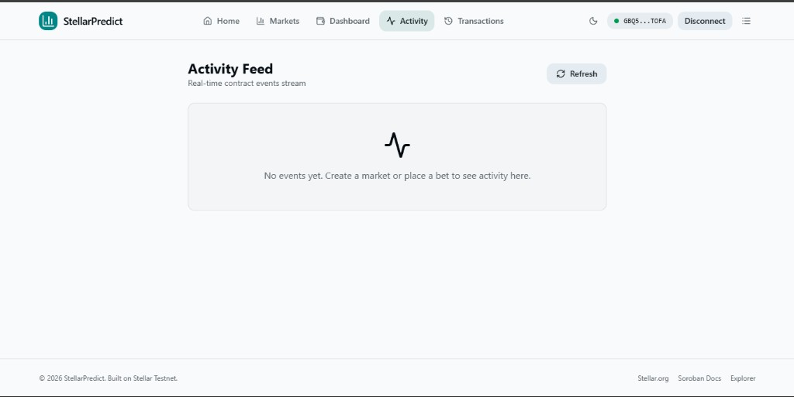
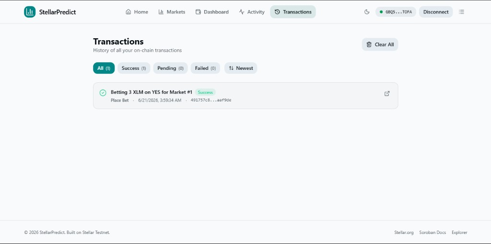
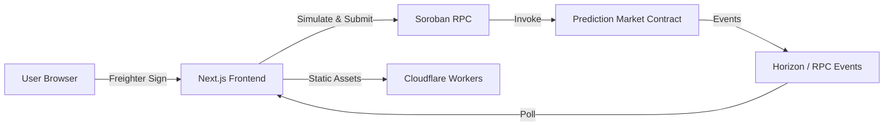

# StellarPredict

**Predict the future on Stellar — decentralized prediction markets powered by Soroban smart contracts.**

[](https://stellar-predict.chatterjeerupak588.workers.dev)
[](https://stellar.org)
[](LICENSE)

---

## Live App

**Try it now:** [https://stellar-predict.chatterjeerupak588.workers.dev](https://stellar-predict.chatterjeerupak588.workers.dev)

Connect your [Freighter](https://www.freighter.app/) wallet (set to **Testnet**), fund it via [Friendbot](https://friendbot.stellar.org/), and start creating or trading in prediction markets.

| Resource | Link |
|----------|------|
| Live App | [stellar-predict.chatterjeerupak588.workers.dev](https://stellar-predict.chatterjeerupak588.workers.dev) |
| Smart Contract | [View on Stellar Expert](https://stellar.expert/explorer/testnet/contract/CDOTOFALVP7MIH35P3CK6I3W6PEZPO4K6DJJLU2XPCSALENFYRPCUVAD) |
| Soroban RPC | `https://soroban-testnet.stellar.org` |

---

## Overview

StellarPredict is a full-stack Web3 prediction market platform where users can:

- **Create markets** with a question, description, and expiry date
- **Bet YES or NO** using native XLM on Stellar Testnet
- **Track odds** with live pool statistics and probability bars
- **Resolve markets** and **claim rewards** after expiry
- **Monitor activity** and on-chain transaction history

All market logic lives on-chain in a Soroban smart contract. The frontend is a static Next.js app deployed to Cloudflare Workers.

---

## Screenshots

### Home — Hero & Platform Stats


Landing page with live platform stats, quick navigation, and Freighter wallet connection.

---

### Markets — Browse & Create


Browse open and resolved markets, search by keyword, filter by status, and create new prediction markets.

---

### Market Detail — Place Bets


View pool breakdown, YES/NO odds, your position, and place bets directly through Freighter.

---

### Dashboard — Wallet & Analytics


Wallet overview, platform analytics, and personal prediction history with wins, losses, and total staked.

---

### Activity — On-Chain Events



Real-time stream of contract events: market creation, bets placed, resolutions, and reward claims.

---

### Transactions — Full History



Filterable transaction log with status badges, timestamps, and links to Stellar Explorer.

---

## Features

| Feature | Description |
|---------|-------------|
| Freighter Wallet | One-click connect via `requestAccess()` with session restore |
| Create Markets | On-chain market creation with XLM token support |
| Place Bets | YES/NO predictions with live odds and pool tracking |
| Resolve & Claim | Market creators resolve outcomes; winners claim rewards |
| Analytics Dashboard | Total markets, volume, active markets, and user stats |
| Activity Feed | Polls Soroban events every 10 seconds |
| Transaction History | Pending / Success / Failed status with explorer links |
| Dark Mode | Toggle between light and dark themes |
| Error Handling | Clear messages for missing wallet, rejected txs, and low balance |

---

## Tech Stack

| Layer | Technology |
|-------|------------|
| Frontend | Next.js 15, React 19, Tailwind CSS, shadcn/ui |
| State | Zustand, TanStack React Query |
| Wallet | `@stellar/freighter-api` |
| Blockchain | Stellar Soroban, `@stellar/stellar-sdk` |
| Smart Contract | Rust + Soroban SDK |
| Deployment | Cloudflare Workers Static Assets, Wrangler |

---

## Smart Contract

Deployed on **Stellar Testnet**:

```
CDOTOFALVP7MIH35P3CK6I3W6PEZPO4K6DJJLU2XPCSALENFYRPCUVAD
```

| Method | Description |
|--------|-------------|
| `create_market` | Create a new prediction market |
| `place_bet` | Place a YES/NO bet with XLM transfer |
| `get_market` | Fetch a single market by ID |
| `get_all_markets` | Fetch all markets |
| `resolve_market` | Creator resolves an expired market |
| `claim_reward` | Claim winnings from a resolved market |
| `get_user_position` | Get a user's YES/NO shares for a market |

Contract source: [`contracts/lib.rs`](contracts/lib.rs)

---

## Getting Started

### Prerequisites

- Node.js 22.13+
- npm
- [Freighter](https://www.freighter.app/) browser extension (Testnet mode)
- [Rust/Cargo](https://rustup.rs/) (only if compiling the contract yourself)

### 1. Clone & Install

```bash
git clone https://github.com/LIGHT-25/Prediction-Market-Platform.git
cd Prediction-Market-Platform
npm install
```

### 2. Environment Setup

```bash
cp .env.example .env
```

The default `.env.example` includes the deployed testnet contract ID. Edit if you deploy your own.

### 3. Run Locally

```bash
npm run dev
```

Open [http://localhost:3000](http://localhost:3000).

### 4. Fund Your Wallet

Visit Friendbot with your public key:

```
https://friendbot.stellar.org/?addr=YOUR_PUBLIC_KEY
```

---

## Deploy Smart Contract (Optional)

To deploy your own contract instance:

```bash
npx tsx scripts/deploy.ts
```

This compiles the Soroban contract, funds a deployer via Friendbot, uploads WASM, instantiates the contract, and writes `NEXT_PUBLIC_CONTRACT_ID` to `.env`.

---

## Deploy Frontend (Cloudflare Workers)

The app uses Next.js static export (`output: "export"`) and deploys to Cloudflare Workers Static Assets.

```bash
npm run build
npm run deploy
```

Build settings for CI:

| Setting | Value |
|---------|-------|
| Build command | `npm run build` |
| Deploy command | `npx wrangler deploy` |
| Node version | `22.13.0` |
| Output directory | `out` (via `wrangler.jsonc`) |

Environment variables (`NEXT_PUBLIC_*`) are baked in at build time. See [`.env.production`](.env.production) for the production defaults.

---

## Project Structure

```
├── app/                    # Next.js App Router pages
│   ├── page.tsx            # Home — hero + stats
│   ├── dashboard/          # Wallet + analytics
│   ├── markets/            # Market list + create form
│   ├── markets/detail/     # Market detail + bet/resolve/claim
│   ├── activity/           # Contract events stream
│   └── transactions/       # Transaction history
├── components/             # UI components (Navbar, Toast, TxModal)
├── contracts/              # Soroban smart contract (Rust)
├── hooks/                  # React Query hooks for contract calls
├── lib/                    # Config, wallet, contract, stores
├── scripts/                # Deployment & debug scripts
├── docs/screenshots/       # README screenshots
└── wrangler.jsonc          # Cloudflare Workers config
```

---

## How It Works



1. User connects Freighter and approves the dApp
2. Frontend builds Soroban transactions and prompts wallet signing
3. Signed transactions are submitted to Soroban Testnet RPC
4. Contract stores markets, bets, and positions on-chain
5. Frontend polls events and updates UI in real time

---

## Verification Checklist

- [x] Connect Freighter wallet on deployed domain
- [x] Create a prediction market
- [x] Place YES/NO bets with XLM
- [x] View dashboard analytics and wallet balance
- [x] Track transactions with status badges
- [ ] Resolve market after expiration
- [ ] Claim reward from resolved market

---

## License

yet to be added

