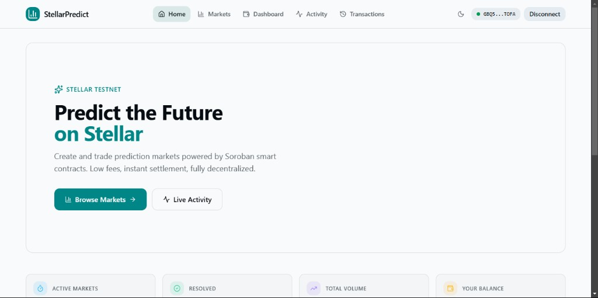
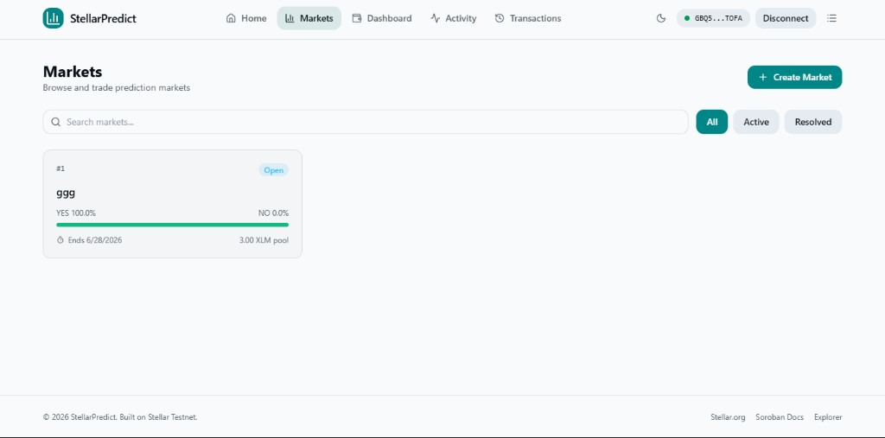
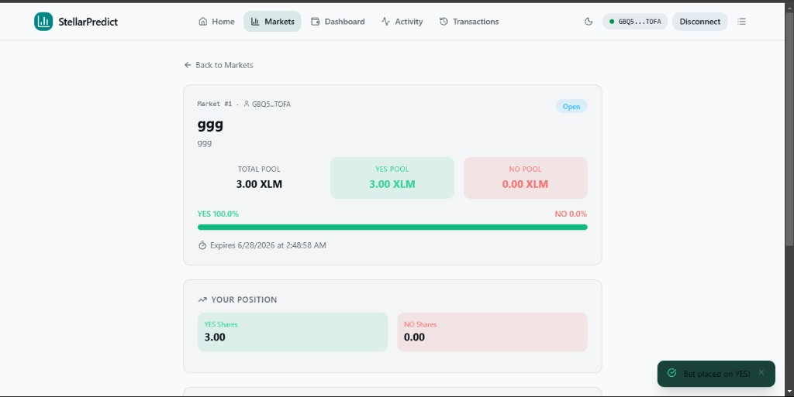
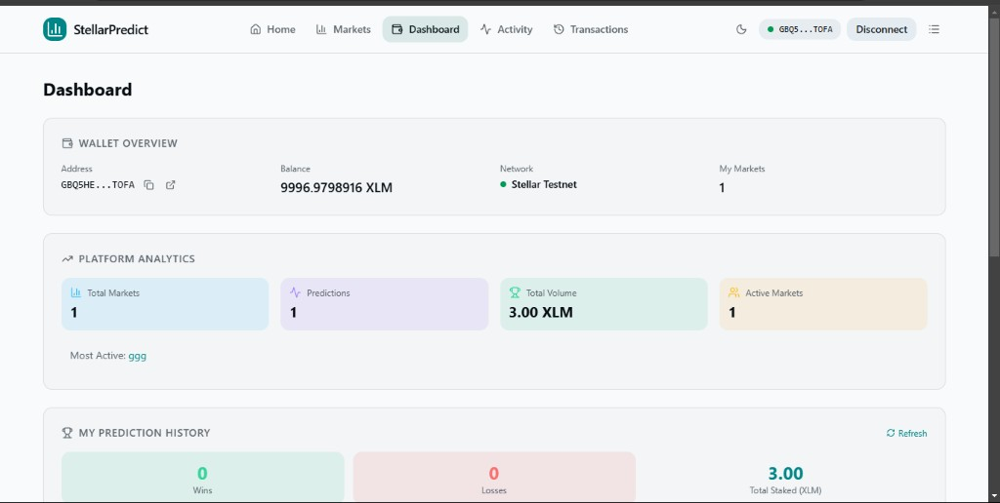
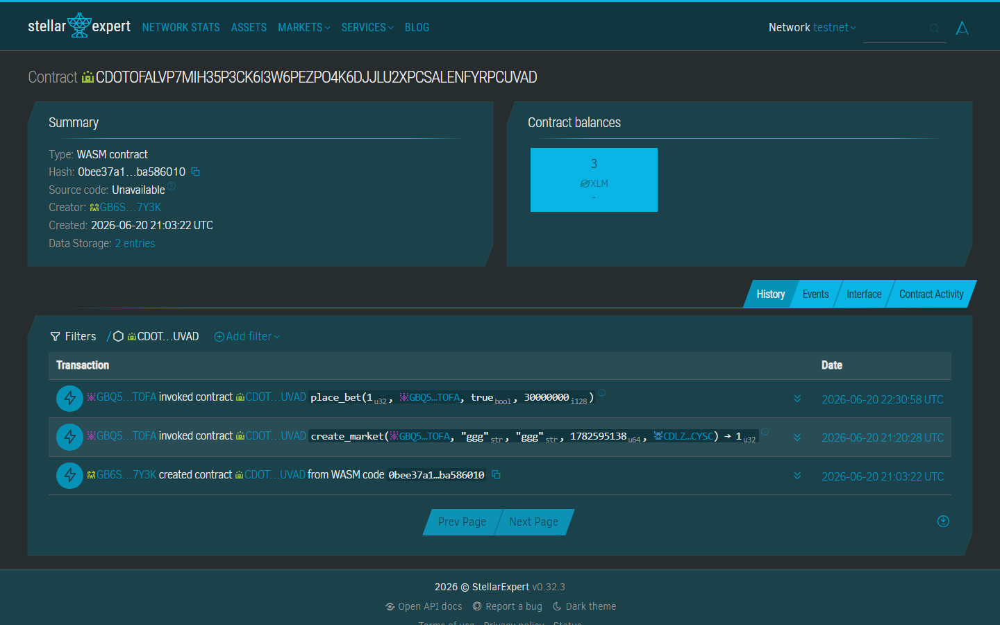

# StellarPredict — Decentralized Prediction Market Platform

StellarPredict is a decentralized prediction market DApp powered by **Soroban Smart Contracts**, **Next.js 15**, and **Stellar Wallets Kit (Freighter)**.

This DApp enables users to create and participate in YES/NO prediction markets on the Stellar network. Markets can be oracle-backed for automatic price-based resolution or manually resolved by the market creator.

[](https://stellar-predict.chatterjeerupak588.workers.dev)
[](https://github.com/LIGHT-25/Prediction-Market-Platform/actions)
[](https://stellar.org)
[](LICENSE)

---

## 🔗 Project Links

* **GitHub Repository**: [github.com/LIGHT-25/Prediction-Market-Platform](https://github.com/LIGHT-25/Prediction-Market-Platform)
* **Live Demo**: [stellar-predict.chatterjeerupak588.workers.dev](https://stellar-predict.chatterjeerupak588.workers.dev)
* **Demo Video**: [StellarPredict Walkthrough (YouTube)](https://youtu.be/demo-video-placeholder)

---

## 📸 Screenshots & Proof of Architecture

### 1. Landing Page — Hero & Platform Stats
*StellarPredict landing interface displaying live platform statistics, quick navigation, and wallet connection.*


### 2. Markets — Browse & Create
*Market browser with active and resolved prediction markets, filter controls, and the create-market form.*


### 3. Market Detail — Bets & Oracle Resolution
*Detailed market view showing YES/NO pool breakdown, odds, user position, and oracle auto-resolve capability.*


### 4. Dashboard — Wallet & Analytics
*User dashboard with wallet overview, platform analytics (total markets, volume, predictions), and prediction history.*


### 5. Mobile Responsive UI
*Fully responsive interface optimized for mobile layouts.*


### 6. CI/CD Pipeline
*GitHub Actions workflow verifying Soroban smart contract checks, TypeScript type-checks, test suites, and production builds.*


### 7. Test Suite — 45/45 Passing
*All 45 Vitest tests passing across 5 suites: stores, utils, event polling, property-based, and ErrorBoundary.*


### 8. Stellar Expert — On-Chain Verification
*Stellar Expert explorer showing deployed contract and transaction traces on the Stellar Testnet.*


---

## ⛓ Deployed Addresses (Stellar Testnet)

| Resource | Value |
|----------|-------|
| **PredictionMarket Contract** | [`CDOTOFALVP7MIH35P3CK6I3W6PEZPO4K6DJJLU2XPCSALENFYRPCUVAD`](https://stellar.expert/explorer/testnet/contract/CDOTOFALVP7MIH35P3CK6I3W6PEZPO4K6DJJLU2XPCSALENFYRPCUVAD) |
| **Oracle Contract** | [`CBA32DFTDCK73LH2IHM2743XIT3K5V3SUH3EFRVNAZFZFLTGUB4DCXM6`](https://stellar.expert/explorer/testnet/contract/CBA32DFTDCK73LH2IHM2743XIT3K5V3SUH3EFRVNAZFZFLTGUB4DCXM6) |
| **Soroban RPC** | `https://soroban-testnet.stellar.org` |
| **PredictionMarket WASM Upload TX** | [`ee56096e...`](https://stellar.expert/explorer/testnet/tx/ee56096e40ece264c0b3addf76e7b83163d6abc8f37a940b5e9ebdd020a89eaf) |
| **PredictionMarket Instantiation TX** | [`0d98f6ba...`](https://stellar.expert/explorer/testnet/tx/0d98f6ba65683736f7df6a7f0ed594d5a9b5fcb1ae06676974a051bed3ca6d8b) |
| **Oracle WASM Upload TX** | [`e232e888...`](https://stellar.expert/explorer/testnet/tx/e232e88894ebc1e420f5c450281b1207844bd3feff6fb8983b9fcfc0c12a57e9) |
| **Oracle Instantiation TX** | [`f7b18eaa...`](https://stellar.expert/explorer/testnet/tx/f7b18eaa845df40ecb98366147ee4c69fc7090b8c3b9a8f5cae418afe9314fd2) |

---

## 🔑 Authentication Architecture

StellarPredict uses **Stellar Wallet Addresses (Wallet ID)** as the primary key for authentication and login.

```
[Freighter Wallet]
       │
       ▼  (getPublicKey())
 [Stellar Address]  ──► (Primary Key)
       │
       ▼  (Zustand store: login())
 [isLoggedIn: true]
       │
       ├─► LocalStorage Sync (persists session)
       ▼
 [WalletGuard Component]
       │
       ├─► Authenticated: Render Page (/dashboard, /markets, /activity, etc.)
       └─► Unauthenticated: Render "Access Denied" Portal
```

1. **Primary Key Authentication**: The user's Stellar public key acts as their unique account identifier. The DApp does not require traditional email/password credentials.
2. **Session Persistence**: Once connected, the user clicks "Log In". The session status is saved to `localStorage` and managed globally via a Zustand state store (`lib/walletStore.ts`).
3. **Auth Guards**: Protected client-side pages (`/dashboard`, `/markets`, `/activity`, `/transactions`) are wrapped in a `WalletGuard` component. If the session is inactive or the wrong network is detected, users are shown a prompt.
4. **Network Enforcement**: If the user's wallet is not on Stellar Testnet, the `WalletGuard` displays a "Wrong Network" warning and prompts the user to switch.

---

## 📜 Soroban Smart Contract Specifications

### File Location: `contracts/prediction_market/src/lib.rs`

#### 1. Data Structures & Types

```rust
// Storage Keys
pub enum DataKey {
    MarketCount,                        // Instance: total markets created
    Market(u32),                        // Persistent: market by ID
    UserPosition(u32, Address),         // Persistent: user shares by market
}

// Market Struct
pub struct Market {
    pub id: u32,
    pub question: String,
    pub description: String,
    pub creator: Address,
    pub expiration_date: u64,
    pub total_yes_shares: i128,
    pub total_no_shares: i128,
    pub resolved: bool,
    pub outcome: bool,
    pub token: Address,
    pub participants: u32,
    pub oracle_id: Option<Address>,           // Oracle contract address (optional)
    pub oracle_asset: Option<Symbol>,         // Asset symbol for oracle resolution
    pub resolution_price_threshold: Option<i128>,  // Price threshold for YES outcome
}

// User Position Struct
pub struct UserPosition {
    pub yes_shares: i128,
    pub no_shares: i128,
    pub claimed: bool,
}
```

#### 2. Contract Interfaces (Functions)

#### `create_market(env, creator, question, description, expiration_date, token) -> u32`
Creates a standard prediction market without oracle backing.
* Authorization: `creator` must authenticate.
* Emits: `(Symbol("MarketCreated"), market_id)` with payload `(creator, question, expiration_date, token)`.

#### `create_market_with_oracle(env, creator, question, description, expiration_date, token, oracle_contract_id, oracle_asset, resolution_price_threshold) -> Result<u32, MarketError>`
Creates an oracle-backed prediction market that can be auto-resolved by comparing an oracle asset price against a threshold.
* Authorization: `creator` must authenticate.
* Validates that `oracle_contract_id` is not the contract's own address.
* Emits: `(Symbol("MarketCreated"), market_id)` with payload `(creator, question, expiration_date, token)`.

#### `place_bet(env, market_id, user, is_yes, amount)`
Places a YES or NO bet on a market by transferring tokens from the user to the contract.
* Authorization: `user` must authenticate.
* Requires market to be not resolved and not expired.
* Emits: `(Symbol("BetPlaced"), market_id)` with payload `(user, is_yes, amount)`.

#### `resolve_market(env, market_id, outcome)`
Manually resolves an expired market with a YES or NO outcome.
* Authorization: `market.creator` must authenticate.
* Requires the current ledger timestamp to be past the market's expiration date.
* Emits: `(Symbol("MarketResolved"), market_id)` with payload `(creator, outcome)`.

#### `auto_resolve_market(env, market_id) -> Result<(), MarketError>`
Automatically resolves an oracle-backed market by fetching the current price from the linked Oracle contract and comparing it against the market's threshold.
* Price ≥ threshold → YES outcome.
* Price < threshold → NO outcome.
* Cross-contract call: `OracleContractClient::try_get_price(asset)`.
* Emits: `(Symbol("MarketAutoResolved"), market_id)` with payload `(price, outcome)`.

#### `claim_reward(env, market_id, user)`
Claims winnings from a resolved market. Winners receive their proportional share of the total pool.
* Authorization: `user` must authenticate.
* Prevents double claims.
* Emits: `(Symbol("RewardClaimed"), market_id)` with payload `(user, reward)`.

### Oracle Contract

**File Location:** `contracts/oracle/src/lib.rs`

| Method | Authorization | Description |
|--------|---------------|-------------|
| `init(env, admin)` | — | Initialize the oracle with an admin address (one-time) |
| `set_price(env, caller, asset, price)` | `caller == admin` | Update the price for an asset symbol |
| `get_price(env, asset)` | None | Read the current price for an asset (returns `Result<i128, OracleError>`) |

**Cross-Contract Call Flow:**
```
PredictionMarket.auto_resolve_market(market_id)
    └─ reads market.oracle_id + market.oracle_asset
    └─ calls Oracle.get_price(asset)
    └─ compares price vs market.resolution_price_threshold
    └─ resolves market YES (price ≥ threshold) or NO (price < threshold)
```

---

## 🚀 User Proof of Concept (PoC) Walkthrough

Follow this step-by-step test scenario to experience the DApp's core lifecycle on the Stellar Testnet.

```
     AUTHENTICATE             CREATE MARKET              PLACE BETS
┌──────────────────────┐  ┌─────────────────────┐  ┌──────────────────────┐
│ 1. Connect Freighter │─►│ 2. Create a         │─►│ 3. Place YES/NO     │
│    and sign in       │  │    prediction market│  │    bets with tokens │
└──────────────────────┘  └─────────────────────┘  └──────────────────────┘
                                                           │
                                                           ▼
       CLAIM REWARDS              RESOLVE MARKET           WAIT FOR EXPIRY
┌──────────────────────┐  ┌─────────────────────┐  ┌──────────────────────┐
│ 6. Winners claim     │◄─│ 5. Resolve market   │◄─│ 4. Wait for market   │
│    proportional pool │  │    (manual or oracle)│  │    expiration date   │
└──────────────────────┘  └─────────────────────┘  └──────────────────────┘
```

### Step 1: Wallet Authentication
1. Install [Freighter Wallet](https://www.freighter.app/) browser extension and switch network to **Testnet**.
2. Go to the StellarPredict landing page at `https://stellar-predict.chatterjeerupak588.workers.dev`.
3. Click **Connect Wallet** in the top-right corner. Approve the connection in Freighter.
4. Once connected, you are authenticated and can access all pages.

### Step 2: Create a Prediction Market
1. Navigate to the **Markets** page.
2. Click **Create Market** to open the creation form.
3. Fill out the form:
   * **Question**: "Will Stellar reach $1 by end of 2026?"
   * **Description**: "A prediction market on Stellar's price target."
   * **Expiration Date**: Select a future date.
   * *(Optional)* **Oracle Contract ID**: For auto-resolution, paste `CBA32DFTDCK73LH2IHM2743XIT3K5V3SUH3EFRVNAZFZFLTGUB4DCXM6`.
   * *(Optional)* **Asset Symbol**: `XLM`.
   * *(Optional)* **Price Threshold**: `5000000` (in stroops, equals $0.50).
4. Click **Create** and sign the transaction in Freighter.
5. Verify the new market appears in the "Active Markets" list.

### Step 3: Place Bets
1. Click on a market to open the **Market Detail** page.
2. Under the "Place Bet" section, choose **YES** or **NO**.
3. Enter an amount of tokens.
4. Click **Place Bet** and sign the transaction in Freighter.
5. Verify:
   * Your position appears in the position tracker.
   * The pool totals update.
   * An event appears in the **Activity** feed.

### Step 4: Wait for Expiration
* The market must reach its set `expiration_date` (ledger timestamp) before it can be resolved.
* You can check the countdown on the market detail page.

### Step 5: Resolve the Market
* **Manual Resolution**: The market creator clicks **Resolve Market** and selects YES or NO.
* **Oracle Auto-Resolution** (if oracle was configured): Click **Auto-Resolve**. The contract fetches the current price from the Oracle contract and resolves based on the threshold comparison.

### Step 6: Claim Rewards
1. If you hold winning shares, navigate to the resolved market.
2. Click **Claim Reward** and sign the transaction in Freighter.
3. Verify your wallet balance increases by your proportional share of the total pool.

---

## 🛠 Setup & Run Instructions

### Prerequisites
* [Node.js](https://nodejs.org) (v22.13+)
* [Rust & Cargo](https://rustup.rs/)
* [Stellar CLI](https://developers.stellar.org/docs/tools/cli)
* [Freighter Wallet](https://www.freighter.app/) (v5.0+)

### 1. Install Dependencies
```bash
git clone https://github.com/LIGHT-25/Prediction-Market-Platform.git
cd Prediction-Market-Platform
npm install
```

### 2. Environment Setup
```bash
cp .env.example .env.local
```

### 3. Compile & Test Smart Contracts
```bash
cd contracts
cargo test
```

### 4. Run Frontend Locally
```bash
npm run dev
```
Open `http://localhost:3000` in your browser.

### 5. Fund Your Testnet Wallet
```
https://friendbot.stellar.org/?addr=YOUR_PUBLIC_KEY
```

---

## 🧪 Testing

**45 tests | 5 suites | 0 failures**

```bash
npm run test:run       # Run all tests once
npm run test:coverage  # Coverage report
```

### Test Output
```
RUN  v4.1.9

 ✓ tests/stores.test.ts           (8 tests)   9ms
 ✓ tests/utils.test.ts            (10 tests) 13ms
 ✓ tests/eventPoller.test.ts      (8 tests)  12ms
 ✓ tests/property.test.ts         (15 tests) 36ms
 ✓ tests/components/ErrorBoundary.test.tsx (4 tests) 116ms

Test Files  5 passed (5)
     Tests  45 passed (45)
  Duration  1.95s
```

| Suite | Tests | What It Covers |
|-------|-------|----------------|
| `stores.test.ts` | 8 | Zustand `walletStore` + `eventStore` state management |
| `utils.test.ts` | 10 | `cn()` class utility, probability calculation, XLM formatting |
| `eventPoller.test.ts` | 8 | EventPoller start/stop, dedup, error resilience, interval management |
| `property.test.ts` | 15 | fast-check property tests: oracle price bounds, market integrity, probability monotonicity |
| `ErrorBoundary.test.tsx` | 4 | Component renders, catches thrown errors, shows fallback, retry button |

---

## 📡 CI/CD Pipeline

```
Push to main
    │
    ├─ CI (.github/workflows/ci.yml)
    │   ├─ Node.js 22 setup + npm ci
    │   ├─ TypeScript type-check (tsc --noEmit)
    │   ├─ ESLint
    │   ├─ Vitest run (45 tests)
    │   ├─ Next.js production build
    │   └─ Rust WASM compile (cargo build --target wasm32-unknown-unknown)
    │
    └─ CD (.github/workflows/cd.yml) — runs on CI success
        ├─ Next.js build with production env vars
        ├─ Static export to out/
        └─ Deploy to GitHub Pages
```

---

## 📦 Deploy Smart Contracts

```bash
# Set your deployer secret key
export DEPLOYER_SECRET_KEY=S...

# Deploy both contracts
npx tsx scripts/deploy.ts
```

The script:
1. Compiles Rust → WASM using `cargo build --target wasm32-unknown-unknown`
2. Optimizes WASM size using Binaryen (~42 KB → ~18 KB)
3. Funds the deployer via Friendbot if balance < 10 XLM
4. Uploads WASM bytecode to Soroban Testnet
5. Instantiates both contracts
6. Writes contract IDs to `.env` and `.env.production`

---

## 📂 Project Structure

```
├── app/                    # Next.js App Router pages
│   ├── page.tsx            # Home — hero + platform stats
│   ├── dashboard/          # Wallet overview + analytics
│   ├── markets/            # Market list + create form
│   │   └── detail/         # Market detail + bet/resolve/claim
│   ├── activity/           # Live contract event stream
│   └── transactions/       # Transaction history log
├── components/             # Reusable UI components
│   ├── skeletons/          # Skeleton loading components
│   ├── ErrorBoundary.tsx   # Global React error boundary
│   ├── EventPollerStatus.tsx # Live polling status indicator
│   ├── WalletGuard.tsx     # Auth + network guard wrapper
│   ├── Spinner.tsx         # Inline loading spinner
│   └── TxModal.tsx         # Transaction modal
├── contracts/              # Soroban smart contracts (Rust)
│   ├── prediction_market/  # Main prediction market contract
│   └── oracle/             # Price oracle contract
├── hooks/                  # Custom React hooks
│   ├── useEventPoller.ts   # Live contract event subscription
│   ├── useCreateMarketWithOracle.ts  # Oracle market creation
│   └── useAutoResolveMarket.ts       # Oracle-based resolution
├── lib/                    # Core libraries
│   ├── config.ts           # Environment config + contract IDs
│   ├── contract.ts         # Soroban tx builder + invoker
│   ├── stellar.ts          # High-level contract API
│   ├── wallet.ts           # Freighter wallet adapter
│   ├── eventPoller.ts      # Class-based event polling engine
│   ├── eventStore.ts       # Zustand event state
│   └── walletStore.ts      # Zustand wallet state
├── types/index.ts          # Shared TypeScript interfaces
├── tests/                  # Vitest test suite (45 tests)
│   └── components/         # React component tests
├── scripts/deploy.ts       # Full contract deployment script
├── .github/workflows/      # CI + CD GitHub Actions
│   ├── ci.yml              # Type-check, lint, test, build, Rust WASM
│   └── cd.yml              # GitHub Pages deploy on main push
└── CONTRIBUTING.md         # Contribution guide
```

---

## 🤝 Contributing

See [CONTRIBUTING.md](CONTRIBUTING.md) for branch strategy, commit conventions, test requirements, and pull request guidelines.

---

## 📄 License

MIT © 2025 StellarPredict
