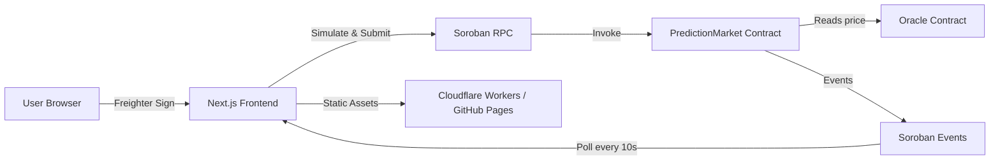

# StellarPredict

**Predict the future on Stellar — decentralized prediction markets powered by Soroban smart contracts.**

[](https://stellar-predict.chatterjeerupak588.workers.dev)
[](https://stellar.org)
[](https://github.com/LIGHT-25/Prediction-Market-Platform/actions)
[](LICENSE)

---

## Live Demo

**Try it now:** [https://stellar-predict.chatterjeerupak588.workers.dev](https://stellar-predict.chatterjeerupak588.workers.dev)

Connect your [Freighter](https://www.freighter.app/) wallet (set to **Testnet**), fund it via [Friendbot](https://friendbot.stellar.org/), and start creating or trading in prediction markets.

| Resource | Link |
|----------|------|
| Live App | [stellar-predict.chatterjeerupak588.workers.dev](https://stellar-predict.chatterjeerupak588.workers.dev) |
| PredictionMarket Contract | [CDOTO…UVAD on Stellar Expert](https://stellar.expert/explorer/testnet/contract/CDOTOFALVP7MIH35P3CK6I3W6PEZPO4K6DJJLU2XPCSALENFYRPCUVAD) |
| Oracle Contract | Deploy your own via `npx tsx scripts/deploy.ts` |
| Soroban RPC | `https://soroban-testnet.stellar.org` |

---

## Overview

StellarPredict is a full-stack Web3 prediction market platform where users can:

- **Create markets** with a question, description, and expiry date
- **Bet YES or NO** using native XLM on Stellar Testnet
- **Track odds** with live pool statistics and probability bars
- **Resolve markets** and **claim rewards** after expiry
- **Auto-resolve markets** using the on-chain Oracle price feed
- **Monitor activity** and on-chain transaction history in real time

All market logic lives on-chain in Soroban smart contracts. The frontend is a static Next.js app.

---

## Screenshots

### Home — Hero & Platform Stats


Landing page with live platform stats, quick navigation, and Freighter wallet connection.

---

### Markets — Browse & Create


Browse open and resolved markets, search by keyword, filter by status, and create new prediction markets.

---

### Market Detail — Place Bets


View pool breakdown, YES/NO odds, your position, and place bets directly through Freighter. Expired markets show a clear warning — betting is closed.

---

### Dashboard — Wallet & Analytics


Wallet overview, platform analytics, and personal prediction history with wins, losses, and total staked.

---

### Activity — On-Chain Events


Real-time stream of contract events: market creation, bets placed, resolutions, and reward claims.

---

### Transactions — Full History


Filterable transaction log with status badges, timestamps, and direct links to Stellar Explorer.

### Stellar Expert Ledger ###


---

## Features

| Feature | Description |
|---------|-------------|
| Freighter Wallet | One-click connect via `requestAccess()` with session restore |
| Network Guard | Detects and warns when wallet is on the wrong Stellar network |
| Create Markets | On-chain market creation with XLM token support |
| Oracle Markets | Create markets linked to an on-chain price oracle for auto-resolution |
| Place Bets | YES/NO predictions with live odds and pool tracking |
| Expired Guard | Bet form is replaced by a clear "Market Expired" warning when betting is closed |
| Resolve & Claim | Market creators resolve outcomes; winners claim rewards |
| Already Claimed | Visual indicator replaces the claim button once rewards are claimed |
| Analytics Dashboard | Total markets, volume, active markets, and user stats |
| Skeleton Loading | Smooth skeleton screens on all data-loading states |
| Event Poller | Polls Soroban contract events every 10 seconds with live indicator |
| Transaction History | Pending / Success / Failed status with tx hash links to Explorer |
| Error Boundary | Catches unexpected UI errors and offers a retry option |
| Dark Mode | Toggle between light and dark themes |

---

## Architecture



1. User connects Freighter and approves the dApp
2. Frontend builds Soroban transactions and prompts wallet signing
3. Signed transactions are submitted to Soroban Testnet RPC
4. PredictionMarket contract can query the Oracle contract for auto-resolution
5. Frontend polls events and updates the Activity feed in real time

---

## Smart Contract Reference

### PredictionMarket Contract

Deployed on **Stellar Testnet**: `CDOTOFALVP7MIH35P3CK6I3W6PEZPO4K6DJJLU2XPCSALENFYRPCUVAD`

| Method | Caller | Description |
|--------|--------|-------------|
| `create_market` | Any | Create a prediction market |
| `create_market_with_oracle` | Any | Create a market with oracle auto-resolution |
| `place_bet` | Any | Place a YES/NO bet with XLM |
| `get_market` | Read | Fetch a single market by ID |
| `get_all_markets` | Read | Fetch all markets |
| `resolve_market` | Creator | Resolve an expired market manually |
| `auto_resolve_market` | Any | Resolve using oracle price feed |
| `claim_reward` | Winner | Claim winnings from a resolved market |
| `get_user_position` | Read | Get a user's YES/NO shares |

### Oracle Contract

| Method | Caller | Description |
|--------|--------|-------------|
| `init` | Admin | Initialize with admin address |
| `set_price` | Admin | Update the oracle price |
| `get_price` | Any | Read the current oracle price |

Contract source: [`contracts/prediction_market/src/lib.rs`](contracts/prediction_market/src/lib.rs) · [`contracts/oracle/src/lib.rs`](contracts/oracle/src/lib.rs)

---

## Getting Started

### Prerequisites

| Tool | Version |
|------|---------|
| Node.js | ≥ 22.13 |
| npm | ≥ 10 |
| Rust | stable |
| wasm32 target | `rustup target add wasm32-unknown-unknown` |
| Freighter | ≥ 5.0 browser extension |

### 1. Clone & Install

```bash
git clone https://github.com/LIGHT-25/Prediction-Market-Platform.git
cd Prediction-Market-Platform
npm install
```

### 2. Environment Setup

```bash
cp .env.example .env.local
```

| Variable | Default |
|----------|---------|
| `NEXT_PUBLIC_RPC_URL` | `https://soroban-testnet.stellar.org` |
| `NEXT_PUBLIC_NETWORK` | `testnet` |
| `NEXT_PUBLIC_NETWORK_PASSPHRASE` | `Test SDF Network ; September 2015` |
| `NEXT_PUBLIC_CONTRACT_ID` | Deployed testnet address |
| `NEXT_PUBLIC_ORACLE_CONTRACT_ID` | _(your oracle address)_ |

### 3. Run Locally

```bash
npm run dev
```

Open [http://localhost:3000](http://localhost:3000).

### 4. Fund Your Wallet

```
https://friendbot.stellar.org/?addr=YOUR_PUBLIC_KEY
```

---

## Testing

```bash
npm run test:run       # Run all tests once
npm run test           # Watch mode
npm run test:ui        # Open Vitest browser UI
npm run test:coverage  # Coverage report
```

### Test Coverage

| Suite | Description |
|-------|-------------|
| `tests/utils.test.ts` | `cn()` class-name utility |
| `tests/stores.test.ts` | Zustand event store |
| `tests/eventPoller.test.ts` | EventPoller lifecycle, dedup, error handling |
| `tests/components/ErrorBoundary.test.tsx` | ErrorBoundary render and fallback |
| `tests/property.test.ts` | fast-check property tests for oracle, market, and probability logic |

---

## Deployment

### Deploy Smart Contracts

```bash
DEPLOYER_SECRET=<your-secret> npx tsx scripts/deploy.ts --network testnet
```

This compiles Rust contracts, deploys Oracle + PredictionMarket to Soroban, and writes contract IDs to `.env.local`.

### Deploy Frontend (GitHub Pages)

Push to `main` → CI runs → CD deploys to GitHub Pages automatically.

Manual deploy (Cloudflare Workers):

```bash
npm run build
npm run deploy
```

| Setting | Value |
|---------|-------|
| Build command | `npm run build` |
| Output directory | `out/` |
| Node version | `22.13.0` |

---

## CI/CD Pipeline

```
Push to main
    │
    ├─ CI: type-check, lint, test, build, Rust WASM compile
    │
    └─ CD (on CI success): deploy static site to GitHub Pages
```

Workflow files: [`.github/workflows/ci.yml`](.github/workflows/ci.yml) · [`.github/workflows/cd.yml`](.github/workflows/cd.yml)

---

## Project Structure

```
├── app/                    # Next.js App Router pages
│   ├── page.tsx            # Home — hero + stats
│   ├── dashboard/          # Wallet + analytics
│   ├── markets/            # Market list + create form
│   │   └── detail/         # Market detail + bet/resolve/claim
│   ├── activity/           # Contract events stream
│   └── transactions/       # Transaction history
├── components/             # UI components
│   ├── skeletons/          # Loading skeleton components
│   ├── ErrorBoundary.tsx   # Global error boundary
│   ├── EventPollerStatus   # Live event polling indicator
│   ├── WalletGuard.tsx     # Wallet/network protection wrapper
│   └── Spinner.tsx         # Inline loading spinner
├── contracts/              # Soroban smart contracts (Rust)
│   ├── prediction_market/  # Main market contract
│   └── oracle/             # Price oracle contract
├── hooks/                  # TanStack Query + mutation hooks
├── lib/                    # Config, wallet, contract, stores
│   ├── eventPoller.ts      # Class-based event polling engine
│   ├── eventStore.ts       # Zustand event state store
│   └── walletStore.ts      # Zustand wallet state store
├── types/index.ts          # Shared TypeScript interfaces
├── tests/                  # Vitest test suite
│   └── components/         # Component-level tests
├── scripts/deploy.ts       # Contract deployment script
├── .github/workflows/      # CI/CD GitHub Actions
└── CONTRIBUTING.md         # Contribution guide
```

---

## Tool Versions

| Tool | Version |
|------|---------|
| Next.js | 15.0.0 |
| React | 19.0.0-rc |
| TypeScript | 5.x |
| TailwindCSS | 3.4.1 |
| Zustand | 5.x |
| TanStack Query | 5.x |
| soroban-sdk | 21.7.7 |
| Rust | 1.96.0 (stable) |
| Vitest | 4.x |
| fast-check | 4.x |

---

## Contributing

See [CONTRIBUTING.md](CONTRIBUTING.md) for guidelines on branches, commits, testing, and the pull request process.

---

## License

yet to be added

