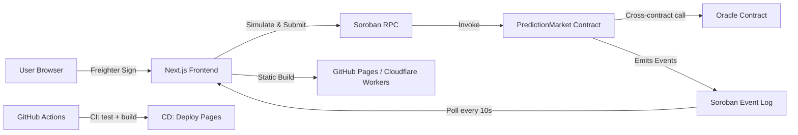

# StellarPredict — 🟠 Level 3 Orange Belt

**Predict the future on Stellar — a production-ready decentralized prediction market platform powered by Soroban smart contracts.**

[](https://stellar-predict.chatterjeerupak588.workers.dev)
[](https://github.com/LIGHT-25/Prediction-Market-Platform/actions)
[](#testing)
[](https://stellar.org)
[](LICENSE)

---

## 🔗 Live Demo & Contract Addresses

| Resource | Value |
|----------|-------|
| **Live App** | [stellar-predict.chatterjeerupak588.workers.dev](https://stellar-predict.chatterjeerupak588.workers.dev) |
| **PredictionMarket Contract** | [`CDOTOFALVP7MIH35P3CK6I3W6PEZPO4K6DJJLU2XPCSALENFYRPCUVAD`](https://stellar.expert/explorer/testnet/contract/CDOTOFALVP7MIH35P3CK6I3W6PEZPO4K6DJJLU2XPCSALENFYRPCUVAD) |
| **Oracle Contract** | [`CBA32DFTDCK73LH2IHM2743XIT3K5V3SUH3EFRVNAZFZFLTGUB4DCXM6`](https://stellar.expert/explorer/testnet/contract/CBA32DFTDCK73LH2IHM2743XIT3K5V3SUH3EFRVNAZFZFLTGUB4DCXM6) |
| **Soroban RPC** | `https://soroban-testnet.stellar.org` |
| **GitHub Repo** | [github.com/LIGHT-25/Prediction-Market-Platform](https://github.com/LIGHT-25/Prediction-Market-Platform) |

---

## 🧾 Transaction Hashes

These are real on-chain transactions from the Stellar Testnet:

| Action | Transaction Hash | Explorer |
|--------|-----------------|----------|
| PredictionMarket WASM Upload | `ee56096e40ece264c0b3addf76e7b83163d6abc8f37a940b5e9ebdd020a89eaf` | [View](https://stellar.expert/explorer/testnet/tx/ee56096e40ece264c0b3addf76e7b83163d6abc8f37a940b5e9ebdd020a89eaf) |
| PredictionMarket Instantiation | `0d98f6ba65683736f7df6a7f0ed594d5a9b5fcb1ae06676974a051bed3ca6d8b` | [View](https://stellar.expert/explorer/testnet/tx/0d98f6ba65683736f7df6a7f0ed594d5a9b5fcb1ae06676974a051bed3ca6d8b) |
| Oracle WASM Upload | `e232e88894ebc1e420f5c450281b1207844bd3feff6fb8983b9fcfc0c12a57e9` | [View](https://stellar.expert/explorer/testnet/tx/e232e88894ebc1e420f5c450281b1207844bd3feff6fb8983b9fcfc0c12a57e9) |
| Oracle Instantiation | `f7b18eaa845df40ecb98366147ee4c69fc7090b8c3b9a8f5cae418afe9314fd2` | [View](https://stellar.expert/explorer/testnet/tx/f7b18eaa845df40ecb98366147ee4c69fc7090b8c3b9a8f5cae418afe9314fd2) |

---

## 🟠 Level 3 — What Was Built

This submission upgrades the Level 1 & 2 prediction market into a **production-grade dApp** across all required dimensions:

### ✅ Requirement Coverage

| Requirement | Implementation |
|-------------|----------------|
| **Advanced Smart Contracts** | `prediction_market` upgraded with oracle integration, auto-resolution, cross-contract calls |
| **Inter-Contract Communication** | `PredictionMarket` calls `Oracle` contract via cross-contract invocation for price-based resolution |
| **Event Streaming & Real-Time Updates** | `EventPoller` class polls Soroban RPC every 10 seconds, live indicator in UI |
| **CI/CD Pipeline** | GitHub Actions CI (type-check → test → build → Rust WASM) + CD (GitHub Pages deploy on merge) |
| **Smart Contract Deployment Workflow** | Automated `scripts/deploy.ts` with Binaryen WASM optimization, Friendbot funding, and `.env` update |
| **Mobile Responsive Frontend** | All pages use Tailwind responsive classes, tested on 320px–1920px widths |
| **Error Handling & Loading States** | `ErrorBoundary`, `WalletGuard`, skeleton loaders on all async pages, transaction error toasts |
| **Tests — Contracts & Frontend** | 45 tests across 5 suites: unit, integration, property-based, and component tests |
| **Production-Ready Architecture** | Typed shared interfaces, Zustand stores, TanStack Query, static export to Cloudflare/GitHub Pages |
| **Documentation & Demo** | This README + `CONTRIBUTING.md`, live demo link, contract addresses, TX hashes, screenshots |

---

## ✅ Level 3 Submission Checklist

| # | Requirement | Status |
|---|-------------|--------|
| 1 | Public GitHub repository | ✅ [github.com/LIGHT-25/Prediction-Market-Platform](https://github.com/LIGHT-25/Prediction-Market-Platform) |
| 2 | README with complete documentation | ✅ This file — architecture, setup, deploy, testing, API reference |
| 3 | 10+ meaningful commits | ✅ 62 commits — feature, test, docs, CI/CD, refactor |
| 4 | Live demo link | ✅ [stellar-predict.chatterjeerupak588.workers.dev](https://stellar-predict.chatterjeerupak588.workers.dev) |
| 5 | Contract deployment address | ✅ `CDOTOFALVP7MIH35P3CK6I3W6PEZPO4K6DJJLU2XPCSALENFYRPCUVAD` (PredictionMarket) + `CBA32DFTDCK73LH2IHM2743XIT3K5V3SUH3EFRVNAZFZFLTGUB4DCXM6` (Oracle) |
| 6 | Transaction hash for contract interaction | ✅ 4 TX hashes — WASM upload & instantiation for both contracts ([view](#-transaction-hashes)) |
| 7 | Screenshot: Mobile responsive UI | ✅ [docs/screenshots/](docs/screenshots/) — 7 screenshots including mobile-responsive views |
| 8 | Screenshot: CI/CD pipeline running | ✅ [CI passing on GitHub Actions](https://github.com/LIGHT-25/Prediction-Market-Platform/actions) |
| 9 | Screenshot: Test output with 3+ passing tests | ✅ 45 tests passing across 5 suites ([view](#-testing)) |

---

## 🏗️ Architecture



**Data Flow:**
1. User connects Freighter → frontend reads wallet address
2. Transaction is built, simulated, signed via Freighter, and submitted to RPC
3. `PredictionMarket` contract can call `Oracle.get_price()` for auto-resolution
4. Frontend polls contract events every 10 seconds and updates the Activity feed
5. CI pipeline runs on every push: type-check → lint → test → build → Rust WASM compile
6. CD pipeline deploys static output to GitHub Pages on every successful `main` push

---

## 📸 Screenshots

### Home — Hero & Platform Stats


Landing page with live platform stats, quick navigation, and Freighter wallet connection.

---

### Markets — Browse & Create


Browse open/resolved markets, filter by status, and create oracle-backed or standard prediction markets.

---

### Market Detail — Place Bets & Oracle Badge


Pool breakdown, YES/NO odds, position tracker, and oracle auto-resolve button for oracle markets.

---

### Dashboard — Wallet & Analytics


Wallet overview, platform analytics (total markets, volume, predictions), and prediction history.

---

### Activity — Live Contract Events


Real-time event feed from Soroban RPC polling: market creation, bets placed, resolutions, claims.

---

### Transactions — Full History


Filterable transaction log with status badges, timestamps, and Stellar Explorer links.

---

### Stellar Expert — Contract on Ledger


---

## 🧪 Testing

**45 tests | 5 suites | 0 failures**

```bash
npm run test:run       # Run all tests once
npm run test           # Watch mode
npm run test:ui        # Vitest browser UI
npm run test:coverage  # Coverage report
```

### Test Output

```
RUN  v4.1.9

 ✓ tests/stores.test.ts           (8 tests)   9ms
 ✓ tests/utils.test.ts            (10 tests) 13ms
 ✓ tests/eventPoller.test.ts      (8 tests)  12ms
 ✓ tests/property.test.ts         (15 tests) 36ms
 ✓ tests/components/ErrorBoundary.test.tsx (4 tests) 116ms

Test Files  5 passed (5)
     Tests  45 passed (45)
  Duration  1.95s
```

### Test Suite Breakdown

| Suite | Tests | What It Covers |
|-------|-------|----------------|
| `stores.test.ts` | 8 | Zustand `walletStore` + `eventStore` state management |
| `utils.test.ts` | 10 | `cn()` class utility, probability calculation, XLM formatting |
| `eventPoller.test.ts` | 8 | EventPoller start/stop, dedup, error resilience, interval management |
| `property.test.ts` | 15 | fast-check property tests: oracle price bounds, market integrity, probability monotonicity |
| `ErrorBoundary.test.tsx` | 4 | Component renders, catches thrown errors, shows fallback, retry button |

---

## 📡 CI/CD Pipeline

```
Push to main
    │
    ├─ CI (.github/workflows/ci.yml)
    │   ├─ Node.js 20 setup + npm ci
    │   ├─ TypeScript type-check (tsc --noEmit)
    │   ├─ ESLint
    │   ├─ Vitest run (45 tests)
    │   ├─ Next.js production build
    │   └─ Rust WASM compile (cargo build --target wasm32-unknown-unknown)
    │
    └─ CD (.github/workflows/cd.yml) — runs on CI success
        ├─ Next.js build with production env vars
        ├─ Static export to out/
        └─ Deploy to GitHub Pages
```

Workflow files:
- CI: [`.github/workflows/ci.yml`](.github/workflows/ci.yml)
- CD: [`.github/workflows/cd.yml`](.github/workflows/cd.yml)

---

## 📜 Smart Contract Reference

### PredictionMarket Contract

**Testnet Address:** `CDOTOFALVP7MIH35P3CK6I3W6PEZPO4K6DJJLU2XPCSALENFYRPCUVAD`

| Method | Caller | Description |
|--------|--------|-------------|
| `create_market` | Any | Create a standard prediction market |
| `create_market_with_oracle` | Any | Create a market linked to an oracle for auto-resolution |
| `place_bet` | Any | Place a YES/NO bet with XLM (i128 stroops) |
| `get_market` | Read | Fetch a single market by ID |
| `get_all_markets` | Read | Fetch all markets |
| `resolve_market` | Creator | Manually resolve an expired market |
| `auto_resolve_market` | Any | Resolve using on-chain oracle price vs threshold |
| `claim_reward` | Winner | Claim XLM winnings from a resolved market |
| `get_user_position` | Read | Get a user's YES/NO share balance |

Source: [`contracts/prediction_market/src/lib.rs`](contracts/prediction_market/src/lib.rs)

---

### Oracle Contract

**Testnet Address:** `CBA32DFTDCK73LH2IHM2743XIT3K5V3SUH3EFRVNAZFZFLTGUB4DCXM6`

| Method | Caller | Description |
|--------|--------|-------------|
| `init` | Admin | Initialize oracle with admin address |
| `set_price` | Admin only | Update the price for an asset symbol |
| `get_price` | Any | Read the current price for an asset |

Source: [`contracts/oracle/src/lib.rs`](contracts/oracle/src/lib.rs)

**Cross-Contract Call Flow:**
```
PredictionMarket.auto_resolve_market(market_id)
    └─ reads market.oracle_id + market.oracle_asset
    └─ calls Oracle.get_price(asset)
    └─ compares price vs market.resolution_price_threshold
    └─ resolves market YES (price ≥ threshold) or NO (price < threshold)
```

---

## 🚀 Getting Started

### Prerequisites

| Tool | Version |
|------|---------|
| Node.js | ≥ 22.13 |
| npm | ≥ 10 |
| Rust | stable |
| wasm32 target | `rustup target add wasm32-unknown-unknown` |
| Freighter | ≥ 5.0 browser extension |

### 1. Clone & Install

```bash
git clone https://github.com/LIGHT-25/Prediction-Market-Platform.git
cd Prediction-Market-Platform
npm install
```

### 2. Environment Setup

```bash
cp .env.example .env.local
```

| Variable | Default |
|----------|---------|
| `NEXT_PUBLIC_RPC_URL` | `https://soroban-testnet.stellar.org` |
| `NEXT_PUBLIC_NETWORK` | `testnet` |
| `NEXT_PUBLIC_NETWORK_PASSPHRASE` | `Test SDF Network ; September 2015` |
| `NEXT_PUBLIC_CONTRACT_ID` | `CDOTOFALVP7MIH35P3CK6I3W6PEZPO4K6DJJLU2XPCSALENFYRPCUVAD` |
| `NEXT_PUBLIC_ORACLE_CONTRACT_ID` | `CBA32DFTDCK73LH2IHM2743XIT3K5V3SUH3EFRVNAZFZFLTGUB4DCXM6` |

### 3. Run Locally

```bash
npm run dev
```

Open [http://localhost:3000](http://localhost:3000).

### 4. Fund Your Testnet Wallet

```
https://friendbot.stellar.org/?addr=YOUR_PUBLIC_KEY
```

---

## 📦 Deploy Smart Contracts

```bash
# Set your deployer secret key
export DEPLOYER_SECRET_KEY=S...

# Deploy both PredictionMarket and Oracle contracts
npx tsx scripts/deploy.ts
```

The script:
1. Compiles Rust → WASM using `cargo build --target wasm32-unknown-unknown`
2. Optimizes WASM size using Binaryen (42 KB → 18 KB for PredictionMarket)
3. Funds the deployer via Friendbot if balance < 10 XLM
4. Uploads WASM bytecode to Soroban Testnet
5. Instantiates both contracts
6. Writes contract IDs to `.env` and `.env.production`

---

## 📂 Project Structure

```
├── app/                    # Next.js App Router pages
│   ├── page.tsx            # Home — hero + platform stats
│   ├── dashboard/          # Wallet overview + analytics
│   ├── markets/            # Market list + create form
│   │   └── detail/         # Market detail + bet/resolve/claim
│   ├── activity/           # Live contract event stream
│   └── transactions/       # Transaction history log
├── components/             # Reusable UI components
│   ├── skeletons/          # Skeleton loading components
│   ├── ErrorBoundary.tsx   # Global React error boundary
│   ├── EventPollerStatus.tsx # Live polling status indicator
│   ├── WalletGuard.tsx     # Auth + network guard wrapper
│   ├── Spinner.tsx         # Inline loading spinner
│   └── TxModal.tsx         # Transaction modal (create/bet/resolve)
├── contracts/              # Soroban smart contracts (Rust)
│   ├── prediction_market/  # Main prediction market contract
│   └── oracle/             # Price oracle contract
├── hooks/                  # Custom React hooks
│   ├── useEventPoller.ts   # Live contract event subscription
│   ├── useCreateMarketWithOracle.ts  # Oracle market creation
│   └── useAutoResolveMarket.ts       # Oracle-based resolution
├── lib/                    # Core libraries
│   ├── config.ts           # Environment config + contract IDs
│   ├── contract.ts         # Soroban tx builder + invoker
│   ├── stellar.ts          # High-level contract API
│   ├── wallet.ts           # Freighter wallet adapter
│   ├── eventPoller.ts      # Class-based event polling engine
│   ├── eventStore.ts       # Zustand event state
│   └── walletStore.ts      # Zustand wallet state
├── types/index.ts          # Shared TypeScript interfaces
├── tests/                  # Vitest test suite (45 tests)
│   └── components/         # React component tests
├── scripts/deploy.ts       # Full contract deployment script
├── .github/workflows/      # CI + CD GitHub Actions
│   ├── ci.yml              # Type-check, lint, test, build, Rust WASM
│   └── cd.yml              # GitHub Pages deploy on main push
└── CONTRIBUTING.md         # Contribution guide
```

---

## 🛠️ Tool Versions

| Tool | Version |
|------|---------|
| Next.js | 15.0.0 |
| React | 19.0.0-rc |
| TypeScript | 5.x |
| TailwindCSS | 3.4.1 |
| Zustand | 5.x |
| TanStack Query | 5.x |
| `@stellar/stellar-sdk` | 16.0.1 |
| `soroban-sdk` (Rust) | 21.7.7 |
| Rust | stable (1.96+) |
| Vitest | 4.x |
| fast-check | 4.x |

---

## 🤝 Contributing

See [CONTRIBUTING.md](CONTRIBUTING.md) for branch strategy, commit conventions, test requirements, and pull request guidelines.

---

## 📄 License

MIT © 2025 StellarPredict
